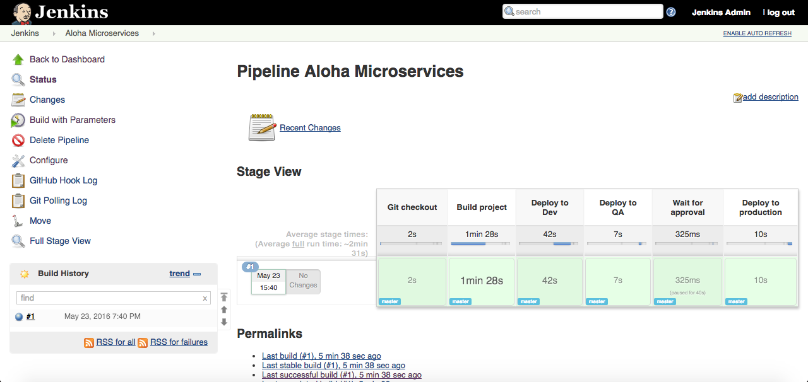

// JBoss, Home of Professional Open Source
// Copyright 2016, Red Hat, Inc. and/or its affiliates, and individual
// contributors by the @authors tag. See the copyright.txt in the
// distribution for a full listing of individual contributors.
//
// Licensed under the Apache License, Version 2.0 (the "License");
// you may not use this file except in compliance with the License.
// You may obtain a copy of the License at
// http://www.apache.org/licenses/LICENSE-2.0
// Unless required by applicable law or agreed to in writing, software
// distributed under the License is distributed on an "AS IS" BASIS,
// WITHOUT WARRANTIES OR CONDITIONS OF ANY KIND, either express or implied.
// See the License for the specific language governing permissions and
// limitations under the License.

## CI/CD Pipeline

### Deploy Jenkins

Install a custom Jenkins image (needs an admin privilege)

----
$ oc login -u admin -p admin
$ oc project openshift
$ oc create -f https://raw.githubusercontent.com/redhat-helloworld-msa/jenkins/master/custom-jenkins.build.yaml
$ oc start-build custom-jenkins-build --follow
----

Now install the Jenkins template in the `ci` project:

----
$ oc login -u openshift-dev -p devel
$ oc new-project ci
$ oc new-app -p MEMORY_LIMIT=1024Mi https://raw.githubusercontent.com/openshift/origin/master/examples/jenkins/jenkins-ephemeral-template.json
$ oc project helloworld-msa
----

### Demo the pipeline

- First introduce `an error` in the production.

----
$ cd aloha/
$ vim src/main/java/com/redhat/developers/msa/aloha/AlohaVerticle.java

#  replace  return String.format("Aloha mai %s", hostname);
#  by       return String.format("Aloca mai %s", hostname);
----

- Deploy the erroneous version in the production area.

----
$ mvn package; oc start-build aloha --from-dir=. --follow
----

- Trigger the build in Jenkins

Wait the server to become available and access: https://jenkins-ci.rhel-cdk.10.1.2.2.xip.io/
Use the credentials (admin/password)

The build should have started automatically. If not, trigger the build yourself.

You should see the pipeline running in: https://jenkins-ci.rhel-cdk.10.1.2.2.xip.io/job/Aloha%20Microservices/

The projects `helloworld-msa-dev` and `helloworld-msa-qa` will be created automatically according to the [defined Pipeline](https://github.com/redhat-helloworld-msa/aloha/blob/master/Jenkinsfile).

- Have at list 2 or 3 Pods running and the readiness probe to show HA during the deployment

----
$ oc patch dc/aloha -p '{"spec":{"template":{"spec":{"containers":[{"name":"aloha","readinessProbe":{"httpGet":{"path":"/api/health","port":8080}}}]}}}}'
$ oc scale dc/aloha --replicas=3
----

Once approved, the fixed project will be applied to the `"production"`.

